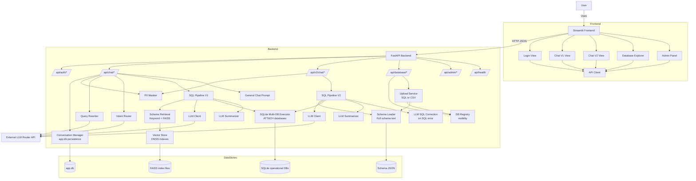

# Architecture Flow Diagrams (Mermaid)

Generated from codepaths in:
- [`frontend/app.py`](frontend/app.py:1)
- [`frontend/api_client.py`](frontend/api_client.py:1)
- [`frontend/views/chat.py`](frontend/views/chat.py:1)
- [`frontend/views/chat_v2.py`](frontend/views/chat_v2.py:1)
- [`backend/main.py`](backend/main.py:1)
- [`backend/api/router.py`](backend/api/router.py:1)
- [`backend/api/chat.py`](backend/api/chat.py:1)
- [`backend/api/chat_v2.py`](backend/api/chat_v2.py:1)
- [`backend/sql/sql_pipeline.py`](backend/sql/sql_pipeline.py:1)
- [`backend/sql/pipeline_v2.py`](backend/sql/pipeline_v2.py:1)
- [`backend/db/session.py`](backend/db/session.py:1)
- [`backend/cache/vector_store.py`](backend/cache/vector_store.py:1)

## Diagram 1: High-level component architecture



## Diagram 2: Chat V1 request flow (sequence)

```mermaid
sequenceDiagram
  participant User
  participant FE as Streamlit
  participant AC as API Client
  participant API as FastAPI
  participant Auth as JWT Verify
  participant CM as Conversation Manager
  participant PII as PII Masker
  participant RW as Query Rewriter
  participant IR as Intent Router
  participant SP1 as SQL Pipeline V1
  participant SR1 as Schema Retrieval
  participant VS as FAISS Vector Store
  participant LLM as LLM Router API
